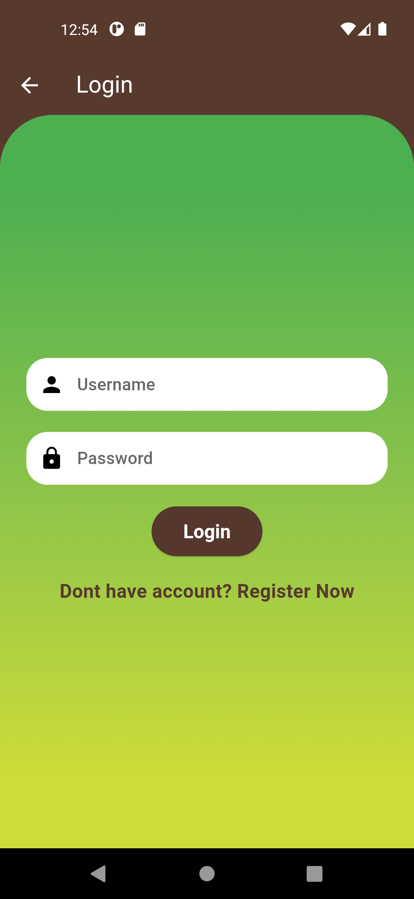
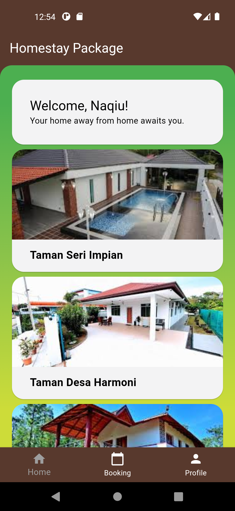

# Homestay Booking App

Homestay Booking App is a web application that allows users to discover and book homestay accommodations. Users can register, log in, and manage their bookings. Administrators can view and manage user registrations and bookings.

## Features

- User registration and authentication
- User profile management
- Booking form submission
- Viewing and updating booking details
- Administrator panel for user and booking management

## Installation

To run the Homestay Booking App locally, follow these steps:

1. Clone the repository:

```bash
git clone https://github.com/afeefnih/Assignment-Mobile.git
```
or use https://desktop.github.com/

<<<<<<< HEAD
## Installation




=======
## Screenshot


>>>>>>> master
